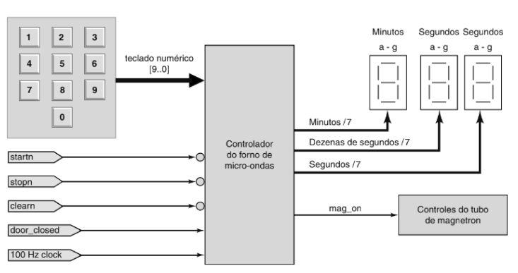

# PROJETO DE SISTEMAS DIGITAIS

O projeto consiste na elaboração de um sistema de microondas utilizando verilog. Todo o processo teve como base o esquema do livro "Sistemas Digitais: Princípios e Aplicativos".

Dividimos a implementação em 4 principais módulos:
    - Encoder
    - Timer
    - Decoder
    - Control

A explicação lógica de cada um dos blocos implementados pode ser encontrada nesse [documento](https://docs.google.com/document/d/15nmmFUa2MDDbS2IJ6Qf_gH-DaQ5WuY7oMwFnzt0bzMU/edit?usp=sharing)

A implementação dele acontecerá em uma placa FBGA Cyclone.
